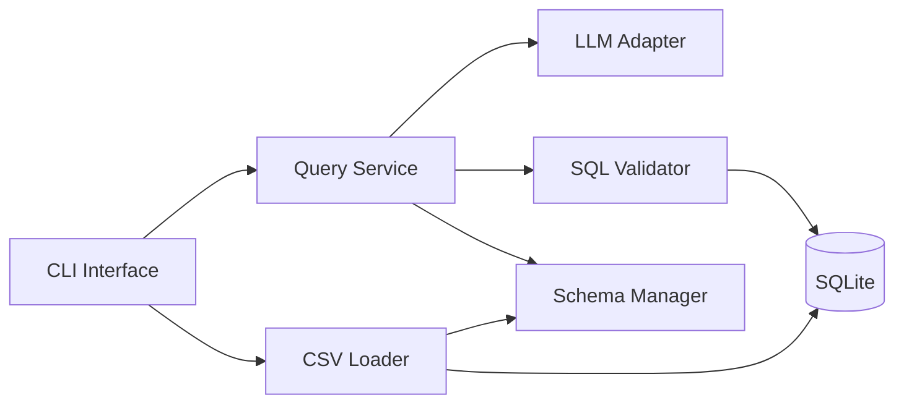

# EC530 Data Systems with LLM Interfaces

This project implements a modular SQLite-based data system that loads structured CSV data, exposes a command-line interface, translates natural-language questions into SQL with an LLM, validates the generated SQL, and only then executes safe read-only queries.

## System overview

The project is split into independent components so each part can be tested in isolation:

- `cli.py`: command-line interface. It never talks to SQLite directly.
- `query_service.py`: service layer that coordinates schema lookup, SQL validation, and execution.
- `llm_adapter.py`: converts natural-language questions into SQLite `SELECT` statements.
- `validator.py`: validates SQL structure and schema references before execution.
- `schema_manager.py`: discovers tables and columns and formats schema context for the LLM.
- `data_loader.py`: reads CSV files, infers schema, creates tables, and appends compatible rows.
- `db.py`: SQLite connection helper.

## Architecture

Primary query flow:

`CLI -> Query Service -> LLM Adapter -> Validator -> SQLite`

Data ingestion flow:

`CLI -> Data Loader -> Schema Manager -> SQLite`



## Design choices

- The CLI is intentionally thin. It handles input and display only.
- The query service is the single gateway for query execution.
- LLM output is treated as untrusted input and is always revalidated.
- The validator operates on query structure and schema references rather than trying to be a full SQL parser.
- CSV ingestion is implemented manually with `executemany`; it does not use `pandas.DataFrame.to_sql()`.
- New tables include `id INTEGER PRIMARY KEY AUTOINCREMENT` as required.
- Schema mismatches during ingestion are logged to `error_log.txt`.

## Setup

```bash
python3 -m venv venv
source venv/bin/activate
pip install -r requirements.txt
cp .env.example .env
python cli.py
```

If you want to use the LLM path, set `OPENAI_API_KEY` in `.env`.

## CLI usage

- `load <csv_path> <table_name>` loads a CSV into SQLite.
- `schema` prints the known tables and columns.
- `sql <SELECT ...>` runs validated SQL directly.
- `ask <natural language question>` sends the prompt to the LLM adapter, validates the returned SQL, and executes it.
- `exit` quits the application.

Example:

```bash
load test.csv employees
schema
sql SELECT name FROM employees
ask show all employee names
```

## Testing

Run the test suite with:

```bash
pytest -q
```

Current tests cover:

- validator acceptance and rejection behavior
- unknown tables and columns
- ambiguous column references
- end-to-end CSV load and query execution
- append behavior for matching schemas
- required auto-increment primary key creation
- schema conflict logging
- a case where bad LLM-style SQL is rejected by the validator

## CI pipeline

GitHub Actions runs `pytest -q` on every push and pull request using `.github/workflows/ci.yml`.

## AI usage

AI was used as a development companion for design refinement and validator implementation support. Final behavior is defined by the project code and tests, not by the LLM. In particular:

- the LLM adapter only generates SQL text
- the validator defines allowed behavior
- unit tests are used to confirm and refine the implementation

One documented failure case is the intentionally bad generated query `SELECT title FROM employees`, which is rejected by the validator because `title` does not exist in the schema.
